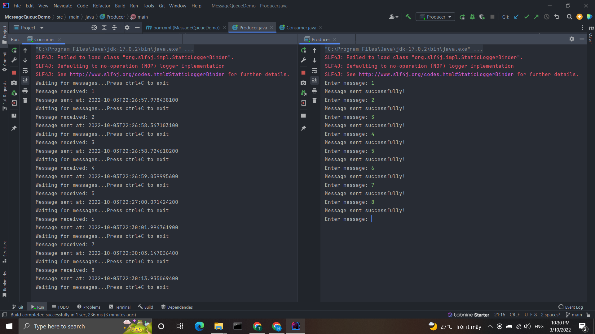
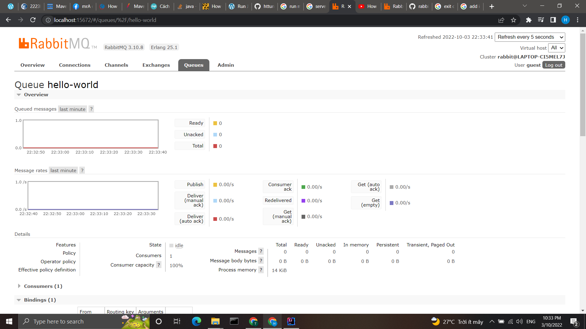

# MessageQueueDemo

A simple demo application of MessageQueue with Rabbitmq. 

Producer and Consumer both work on localhost:15672, which is the default server of Rabbitmq. Producer enqueue messages
until user enter SHUTDOWN message while each instance of Consumer dequeue and display all incoming messages in the
queue.

  

For a closer look, go to localhost:15672 with Rabbitmq installed to see the full process with Rabbitmq GUI.

